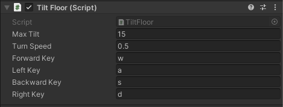

Using <kbd>Shift</kbd> select **all** the parts of your Scene that you want to rotate - including any and the **Planes**.

Right click and select **Create Empty Parent** - rename the new parent object "Level".

With the 'Level' GameObject selected add the `TiltFloor` script component. 

--- collapse ---

---
title: I dont have a TiltWorld script.
---

With 'Level' selected, add a new script component called `TiltFloor`. 

Drag the new script file from your Assets into the 'Scripts' folder to organise your files. 

Open the new script in your code editor. Type out or copy and paste the following code: 

--- code ---
---
language: cs
filename: TiltFloor.cs
line_numbers: true
line_number_start: 
line_highlights: 
---

using System.Collections;
using System.Collections.Generic;
using UnityEngine;

public class TiltFloor : MonoBehaviour
{
    public float maxTilt;
    public float turnSpeed;

    public string forwardKey;
    public string leftKey;
    public string backwardKey;
    public string rightKey;

    // Update is called once per frame
    void Update()
    {
        float targetXRotation = 0;
        float targetZRotation = 0;

        if (Input.GetKey(forwardKey)){
            targetXRotation += maxTilt;
        }

        if (Input.GetKey(backwardKey)){
            targetXRotation += 360 - maxTilt;
        }

        if (Input.GetKey(rightKey)){
            targetZRotation += 360 - maxTilt;
        }

        if (Input.GetKey(leftKey)){
            targetZRotation += maxTilt;
        }

        transform.rotation = Quaternion.Lerp(transform.rotation, Quaternion.Euler(targetXRotation, 0, targetZRotation), turnSpeed * Time.deltaTime);
    }
}

--- /code ---

Save your script and head back to the Unity editor.

--- /collapse ---

In the Inspector set the 'Max Tilt' variable to `15` and the 'Turn Speed' to `0.5`. 

**Choose** The keys you want to use for the tilting the track. In our example we are using the <kbd>WASD</kbd> layout.

